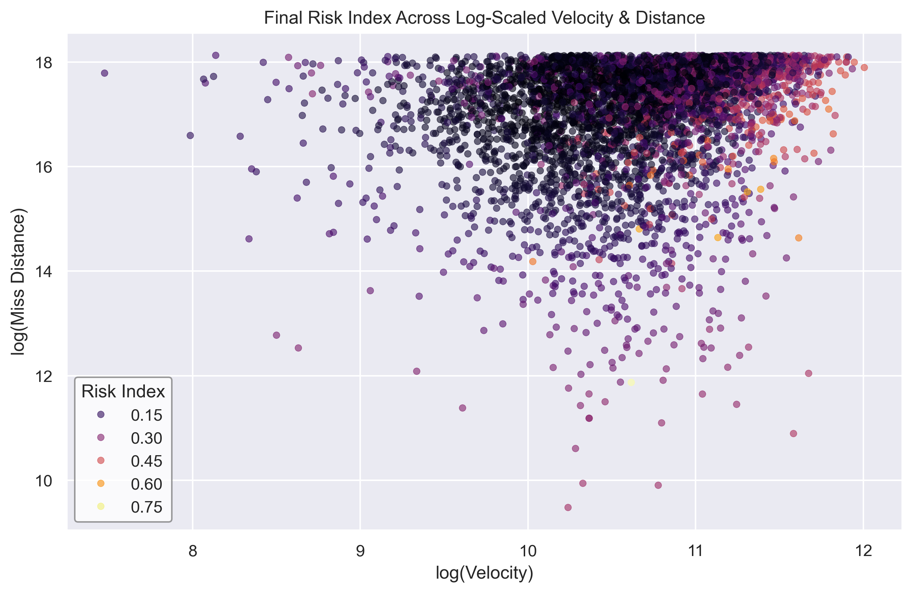

# 🌍 NASA NEO Risk Modeling
Time‑series analysis, anomaly detection, and operational risk modeling using Near‑Earth Object (NEO) close‑approach data
## 📌 Overview
This project analyzes NASA Near‑Earth Object (NEO) close‑approach data to model the risk of asteroid flybys using:

time‑series analysis

anomaly detection

uncertainty modeling

multi‑variable feature engineering

The dataset includes information about thousands of asteroids that pass near Earth, including:

close‑approach dates

relative velocity

miss distance

estimated diameter

orbit uncertainty

hazard classification

This project reframes the dataset as an operational risk problem:

Which asteroid approaches are “normal,” and which represent anomalous or elevated‑risk events?

## 🎯 Objectives
Build a clean, reproducible pipeline for loading and processing NEO close‑approach data

Engineer features that capture velocity, distance, uncertainty, and orbital behavior

Apply anomaly detection to identify unusual or high‑risk flybys

Model risk scores using interpretable methods

Visualize asteroid trajectories and risk patterns over time

## 📂 Repository Structure
```
nasa-neo-risk-modeling/
│
├── data/
│   ├── raw/          # downloaded NEO dataset (ignored by git)
│   ├── processed/    # cleaned + engineered data
│
├── notebooks/
│   ├── 01_explore_data.ipynb
│   ├── 02_feature_engineering.ipynb
│   ├── 03_risk_modeling.ipynb
│   ├── 04_anomaly_detection.ipynb
│
├── src/
│   ├── data_loaders.py
│   ├── feature_engineering.py
│   ├── risk_models.py
│   ├── anomaly_detection.py
│   ├── utils.py
│
├── reports/
│   ├── figures/
│   ├── tables/
│
├── docs/
│   ├── project_overview.md
│   ├── methodology.md
│   ├── findings.md
│
├── tests/
│   ├── test_data_loaders.py
│   ├── test_feature_engineering.py
│
├── .gitignore
└── README.md
```
## 🧠 Methods
1. Data Loading & Cleaning
Load NEO close‑approach CSV

Normalize column names

Convert timestamps

Handle missing values

Standardize units (km, km/s, AU)

2. Feature Engineering
relative velocity magnitude

normalized miss distance

orbit uncertainty score

size × velocity composite risk

rolling risk indicators

anomaly‑sensitive transformations

3. Risk Modeling
interpretable scoring models

distance‑velocity risk surfaces

uncertainty‑weighted risk curves

4. Anomaly Detection
Isolation Forest

Local Outlier Factor

Z‑score outlier detection

clustering‑based anomaly detection

5. Visualization
time‑series risk curves

scatterplots of velocity vs. distance

anomaly overlays

uncertainty heatmaps

## 📈 Final Risk Index Visualization
The plot below illustrates how the combined risk index varies across two of the most physically meaningful features in the dataset:
log‑scaled relative velocity and log‑scaled miss distance.



This visualization reveals several important patterns:

Higher‑risk objects cluster toward higher velocities and smaller miss distances, which aligns with physical intuition — fast, close‑approaching objects pose greater potential danger.

The risk gradient is smooth, indicating that the combined model (supervised + unsupervised + engineered features) produces a coherent, interpretable risk surface rather than noisy or unstable predictions.

Hazardous objects (NASA‑labeled) tend to occupy the upper‑right region of the plot, validating that the model captures meaningful structure in the data.

The distribution also highlights rare, high‑risk outliers, which the anomaly detector helps surface even when labels are sparse.

This figure serves as a high‑level summary of the project’s core insight:
risk is not driven by a single feature, but by the interaction of velocity, distance, size, and anomaly behavior.

## 🚀 Future Work
Build a real‑time NEO risk dashboard

Add orbit propagation modeling

Incorporate JPL Horizons ephemeris data

Compare anomaly signatures across decades

## 📦 Dataset
You will download the NEO close‑approach dataset from a stable public source (e.g., Kaggle).
Save it as:

```
data/raw/neos.csv
```
🧪 Environment
Python 3.10+
Recommended packages:

```
pandas
numpy
matplotlib
seaborn
scikit-learn
jupyter
```